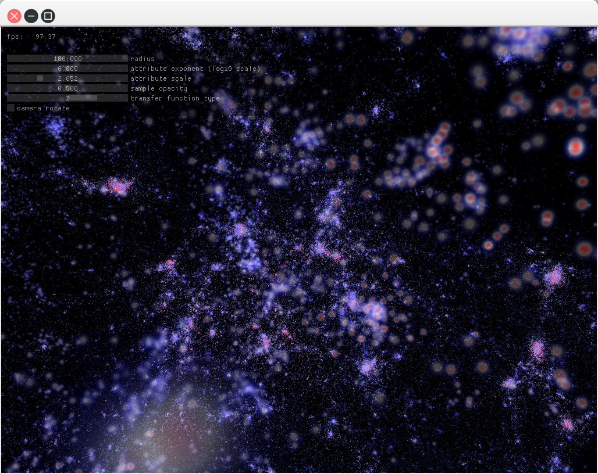

optixParticleVolumes
==========

Three-dimensional radial basis function (RBF) volume rendering within a ray tracer. 
- Demonstrates how to use OptiX BVH traversal for volumetric depth samples of unstructured geometry. 
- Provides a reference for particle volume rendering, similar to splatting, within OptiX.

The sample data set is the first 1 million particles from the 2014 Dark Sky cosmology simulation, 
http://darksky.slac.stanford.edu/edr.html

The technique is similar to one in this paper:

Aaron Knoll, Ingo Wald, Paul Navratil, Anne Bowen, Khairi Reda, Michael E Papka, and Kelly P Gaither.
RBF Volume Ray Casting on Multicore and Many-Core CPUs
Computer Graphics Forum 33(3), p 71--80, 2014. (Proc. Eurovis 2014)

Instead of resampling particles into equidistant regular samples along the ray, we explicitly project one sample per particle, sort them by depth and integrate. This pattern could similarly be used for other unstructured volume data using ray traversal in OptiX. 
