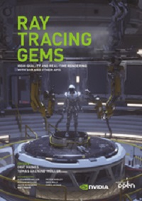

# Apress Source Code

This repository accompanies [*Ray Tracing Gems: High-Quality and Real-Time Rendering with DXR and Other APIs*](https://www.apress.com/9781484244265) by Eric Haines and Tomas Akenine-M�ller (Apress, 2019).

See [http://raytracinggems.com](http://raytracinggems.com) for further information about the book.

[comment]: #cover

Download or clone the files as a zip using the green button in the upper right, or clone the repository to your machine using Git with https://github.com/Apress/ray-tracing-gems.git

Note that code with a \*.cu or \*.cuh suffix is written in CUDA. The various CUDA functions can be found [in this set of reference pages](https://docs.nvidia.com/cuda/cuda-math-api/modules.html#modules). Code with an \*.hlsl suffix is in the High Level Shading Language, with its [function reference here](https://docs.microsoft.com/en-us/windows/win32/direct3dhlsl/dx-graphics-hlsl-intrinsic-functions).

## Releases

Errata for the book [is available](errata.md).

Release v1.0 corresponds to the code in the published book, with three corrections to Chapter 16:

Page 226: "float SampleLinear( float a, float b ) {" should have a "float u" parameter for the random variable, i.e., "float SampleLinear( float u, float a, float b ) {"

Page 235, file ConcentricSquareMapping.cpp: The case "a == 0 && b == 0" is not handled and can result in division by 0; above line 3 add "if (b == 0) b = 1;"

Page 242, file PhongDistribution.cpp: Line 1 of the code at the top, change "1+s" to "2+s"

## Contributions

See the file [Contributing.md](Contributing.md) for more information on how you can contribute to this repository.

## License

All code here is released under the [MIT License](https://opensource.org/licenses/MIT), copyright 2019 NVIDIA Corporation, unless otherwise noted within an individual chapter's files. This license reads as follows:

>Copyright 2019 NVIDIA Corporation
>
>Permission is hereby granted, free of charge, to any person obtaining a copy of this software and associated documentation files (the "Software"), to deal in the Software without restriction, including without limitation the rights to use, copy, modify, merge, publish, distribute, sublicense, and/or sell copies of the Software, and to permit persons to whom the Software is furnished to do so, subject to the following conditions:
>
>The above copyright notice and this permission notice shall be included in all copies or substantial portions of the Software.
>
>THE SOFTWARE IS PROVIDED "AS IS", WITHOUT WARRANTY OF ANY KIND, EXPRESS OR IMPLIED, INCLUDING BUT NOT LIMITED TO THE WARRANTIES OF MERCHANTABILITY, FITNESS FOR A PARTICULAR PURPOSE AND NONINFRINGEMENT. IN NO EVENT SHALL THE AUTHORS OR COPYRIGHT HOLDERS BE LIABLE FOR ANY CLAIM, DAMAGES OR OTHER LIABILITY, WHETHER IN AN ACTION OF CONTRACT, TORT OR OTHERWISE, ARISING FROM, OUT OF OR IN CONNECTION WITH THE SOFTWARE OR THE USE OR OTHER DEALINGS IN THE SOFTWARE.
